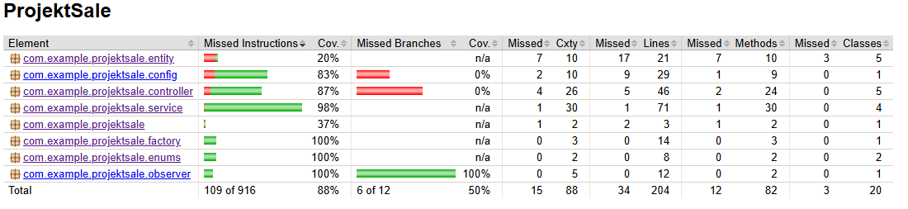
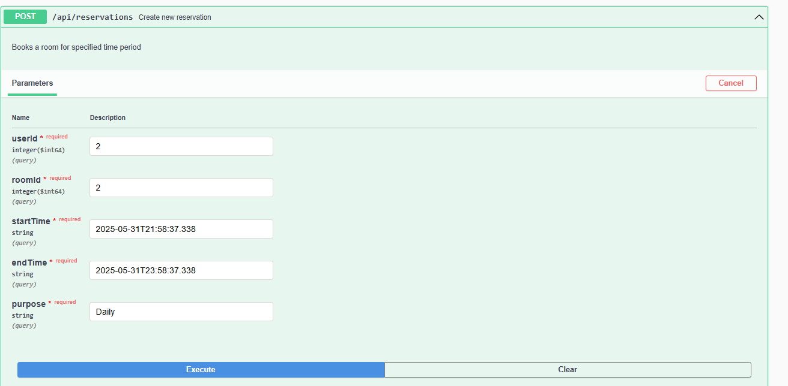

# Aplikacja Zarządzania Salami Konferencyjnymi


## I. Temat

Zarządzanie salami konferencyjnymi - aplikacja do rezerwacji sal oraz administracji sprzętu 
konferencyjnego

## II. Opis

Aplikacja  do zarządzania salami konferencyjnymi, rezerwacjami oraz 
sprzętem technicznym. System umożliwia użytkownikom rezerwowanie sal na 
określone terminy, a administratorom zarządzanie całą infrastrukturą konferencyjną. 

## III. Realizowane systemy

### 1. System zarządzania salami
- Dodawanie, edycja i usuwanie sal konferencyjnych
- Zarządzanie dostępnością sal
- Przypisywanie sprzętu do konkretnych sal
- Wyszukiwanie sal według różnych kryteriów

### 2. System zarządzania użytkownikami (RBAC)
- **USER**: Przeglądanie dostępnych sal, tworzenie rezerwacji, zarządzanie własnymi rezerwacjami, podgląd informacji o sprzęcie
- **ADMIN**: Wszystkie funkcjonalności użytkownika rozszerzone o zarządzanie salami, użytkownikami, sprzętem oraz wszystkimi rezerwacjami w systemie

### 3. System rezerwacji sal
- Tworzenie rezerwacji z określeniem celu spotkania
- Sprawdzanie dostępności sal w wybranym terminie
- Anulowanie rezerwacji
- Historia rezerwacji użytkownika
- Zarządzanie statusami rezerwacji (PENDING, CONFIRMED, CANCELLED, COMPLETED)

### 4. System zarządzania sprzętem
- Katalogowanie sprzętu konferencyjnego (komputery, projektory)
- Przypisywanie sprzętu do konkretnych sal
- Wykonywanie czynności konserwacyjnych
- Śledzenie stanu technicznego sprzętu

### 5. System autoryzacji i bezpieczeństwa
- Kontrola dostępu oparta na rolach (Role-Based Access Control)
- Bezpieczne uwierzytelnianie użytkowników
- Szyfrowanie haseł za pomocą BCrypt
- Ochrona endpoints według uprawnień użytkownika

## IV. Struktura Projektu

```
src/
├── main/
│   ├── java/com/example/projektsale/
│   │   ├── config/                    # Konfiguracja Spring Security
│   │   │   └── SecurityConfig.java
│   │   ├── controller/                # Kontrolery REST API
│   │   │   ├── AuthController.java
│   │   │   ├── EquipmentController.java
│   │   │   ├── ReservationController.java
│   │   │   ├── RoomController.java
│   │   │   └── UserController.java
│   │   ├── entity/                    # Encje JPA
│   │   │   ├── User.java
│   │   │   ├── Room.java
│   │   │   ├── Reservation.java
│   │   │   ├── Equipment.java         # Klasa abstrakcyjna
│   │   │   ├── ComputerEquipment.java # Implementacja polimorfizmu
│   │   │   └── ProjectorEquipment.java
│   │   ├── enums/                     # Enumeracje
│   │   │   ├── Role.java
│   │   │   └── ReservationStatus.java
│   │   ├── factory/                   # Wzorzec Factory
│   │   │   └── EquipmentFactory.java
│   │   ├── observer/                  # Wzorzec Observer
│   │   │   ├── ReservationObserver.java
│   │   │   └── NotificationObserver.java
│   │   ├── repository/                # Repozytoria Spring Data
│   │   │   ├── UserRepository.java
│   │   │   ├── RoomRepository.java
│   │   │   ├── ReservationRepository.java
│   │   │   └── EquipmentRepository.java
│   │   ├── service/                   # Logika biznesowa
│   │   │   ├── UserService.java
│   │   │   ├── RoomService.java
│   │   │   ├── ReservationService.java
│   │   │   └── EquipmentService.java
│   │   └── ProjektSaleApplication.java
│   └── resources/
│       ├── db/migration/              # Migracje Flyway
│       ├── application.properties
│       └── application-test.properties
├── test/                              
│   └── java/com/example/projektsale/
│       ├── controller/                # Testy kontrolerów
│       ├── observer/                  # Testy wzorca Observer
│       ├── service/                   # Testy serwisów
│       └── ProjektSaleApplicationTests.java
├── docker-compose.yml                 # Konfiguracja Docker
├── Dockerfile                         # Definicja obrazu Docker
└── pom.xml                           # Konfiguracja Maven
```

## V. Diagram ERD


## VI. Tabele bazodanowe

Aplikacja wykorzystuje PostgreSQL z następującymi tabelami:

### 1. **users** - Informacje o użytkownikach systemu
- `id`: BIGSERIAL 
- `username`: VARCHAR(50) UNIQUE 
- `email`: VARCHAR(100) UNIQUE 
- `password`: VARCHAR(255) 
- `role`: VARCHAR(20) 
- `created_at`, `updated_at`: TIMESTAMP 

### 2. **rooms** - Katalog sal konferencyjnych
- `id`: BIGSERIAL 
- `name`: VARCHAR(100) 
- `capacity`: INTEGER 
- `location`: VARCHAR(200) 
- `description`: TEXT 
- `is_available`: BOOLEAN 
- `created_at`, `updated_at`: TIMESTAMP

### 3. **reservations** - Rezerwacje sal
- `id`: BIGSERIAL 
- `user_id`: BIGINT 
- `room_id`: BIGINT 
- `start_time`, `end_time`: TIMESTAMP 
- `status`: VARCHAR(20) 
- `purpose`: VARCHAR(500) 
- `notes`: TEXT 
- `created_at`, `updated_at`: TIMESTAMP

### 4. **equipment** - Sprzęt konferencyjny (Single Table Inheritance)
- `id`: BIGSERIAL 
- `equipment_type`: VARCHAR(50) 
- `name`: VARCHAR(255) 
- `description`: TEXT 
- `is_working`: BOOLEAN 
- `room_id`: BIGINT 
- Pola specyficzne dla komputerów: `operating_system`, `processor`, `ram_gb`
- Pola specyficzne dla projektorów: `resolution`, `brightness`

## VII. Pakiety główne

### config
Zawiera konfigurację bezpieczeństwa aplikacji:
- **SecurityConfig**: Konfiguracja Spring Security z definicją uprawnień, uwierzytelniania oraz autoryzacji endpoints

### controller
Kontrolery REST API obsługujące żądania HTTP:
- **AuthController**: Zarządzanie uwierzytelnianiem użytkowników
- **UserController**: Operacje CRUD na użytkownikach (tylko ADMIN)
- **RoomController**: Zarządzanie salami konferencyjnymi
- **ReservationController**: System rezerwacji sal
- **EquipmentController**: Zarządzanie sprzętem konferencyjnym

### entity
Encje JPA reprezentujące model danych:
- **User**: Użytkownicy systemu z rolami
- **Room**: Sale konferencyjne z ich charakterystykami
- **Reservation**: Rezerwacje z pełną historią
- **Equipment**: Abstrakcyjna klasa bazowa dla sprzętu
- **ComputerEquipment**, **ProjectorEquipment**: Konkretne implementacje sprzętu

### service
Warstwa logiki biznesowej:
- **UserService**: Zarządzanie użytkownikami i bezpieczeństwem
- **RoomService**: Operacje na salach
- **ReservationService**: Logika rezerwacji z powiadomieniami
- **EquipmentService**: Zarządzanie sprzętem z wykorzystaniem wzorca Factory

## VIII. Kontrolery REST API

### 1. **AuthController** (`/api/auth`)
- `GET /me` - Informacje o zalogowanym użytkowniku

### 2. **UserController** (`/api/users`) 
- `GET /` - Pobranie wszystkich użytkowników
- `GET /{id}` - Pobranie użytkownika po ID
- `POST /` - Utworzenie nowego użytkownika
- `DELETE /{id}` - Usunięcie użytkownika

### 3. **RoomController** (`/api/rooms`)
- `GET /` - Lista wszystkich sal
- `GET /{id}` - Konkretna sala
- `POST /` - Dodanie nowej sali

### 4. **ReservationController** (`/api/reservations`)
- `GET /` - Lista wszystkich rezerwacji
- `POST /` - Nowa rezerwacja
- `GET /user/{userId}` - Rezerwacje konkretnego użytkownika
- `GET /room/{roomId}` - Rezerwacje konkretnej sali
- `DELETE /{id}` - Anulowanie rezerwacji

### 5. **EquipmentController** (`/api/equipment`)
- `GET /` - Lista całego sprzętu
- `POST /computer` - Dodanie komputera (*tylko ADMIN*)
- `POST /projector` - Dodanie projektora (*tylko ADMIN*)
- `POST /{id}/maintenance` - Wykonanie konserwacji
- `GET /room/{roomId}` - Sprzęt w konkretnej sali
- `DELETE /{id}` - Usunięcie sprzętu (*tylko ADMIN*)

## IX. Polimorfizm

Projekt implementuje polimorfizm poprzez hierarchię klas sprzętu konferencyjnego:


## X. Wzorce projektowe

### 1. **Factory Pattern** - `EquipmentFactory`
Wzorzec Factory służy do tworzenia różnych typów sprzętu:


### 2. **Observer Pattern** - System powiadomień
Wzorzec Observer implementuje system powiadomień o nowych rezerwacjach:


### 3. **Repository Pattern**
Wszystkie repozytoria rozszerzają `JpaRepository`, zapewniając standardowe 
operacje CRUD.

### 4. **MVC Pattern**
Aplikacja wykorzystuje wzorzec Model-View-Controller poprzez podział na warstwy:
- **Model**: Encje JPA i logika biznesowa
- **View**: REST API jako interfejs
- **Controller**: Kontrolery REST obsługujące żądania

## XI. Autoryzacja i bezpieczeństwo

System implementuje kompletną kontrolę dostępu opartą na rolach (RBAC):

### Mechanizm uwierzytelniania
- **HTTP Basic Authentication** z wykorzystaniem Spring Security
- **BCrypt** do szyfrowania haseł użytkowników

### Role użytkowników

#### USER - Standardowy użytkownik

#### ADMIN - Administrator systemu


## XII. Uruchamianie projektu

### Wymagania systemowe
- Java 21+
- Maven 3.9+
- Docker i Docker Compose
- PostgreSQL (automatycznie przez Docker)

### Kroki uruchomienia

1. **Klonowanie repozytorium**
```bash
git clone https://github.com/Zabqus/ProjektSale
cd ProjektSale
```

2. **Budowanie aplikacji**
```bash
mvn clean package -DskipTests
```

3. **Uruchomienie za pomocą Docker Compose**
```bash
docker-compose up --build
```

4. **Dostęp do aplikacji**
- **API**: http://localhost:8080
- **Swagger UI**: http://localhost:8080/swagger-ui.html
- **PostgreSQL**: localhost:5433

### Predefiniowani użytkownicy
Po uruchomieniu aplikacji dostępni są następujący użytkownicy:
- **admin** / **123** - Administrator 
- **Wiktor** / **123** - Standardowy użytkownik
- **user** / **123** - Standardowy użytkownik

### Dane testowe
Aplikacja automatycznie tworzy:
- 3 przykładowe sale konferencyjne
- Podstawowy sprzęt (projektory i komputery)
- Przykładowe rezerwacje

## XIII. Testowanie

Projekt zawiera zestaw testów zapewniających wysokie pokrycie kodu.

### Uruchomienie testów
```bash
# Wszystkie testy
mvn clean test

# Raport pokrycia JaCoCo
mvn clean test jacoco:report
```


### Przykład testu kontrolera


### Pokrycie kodu (JaCoCo)
Aplikacja spełnia wymaganie minimum 80% pokrycia kodu testami:



*Raport w: `target/site/jacoco/index.html`*


## XIV. Przykładowe działanie systemu

### Swagger UI - Interfejs API


### 1. Uwierzytelnianie użytkownika


### 2. Przeglądanie dostępnych sal


### 3. Tworzenie rezerwacji sali



### 4. Zarządzanie sprzętem


### 5. Wykonywanie konserwacji sprzętu


### 6. Dodawanie nowego sprzętu


### 7. Usuwanie użytkownika


### 8. System powiadomień (Console)


